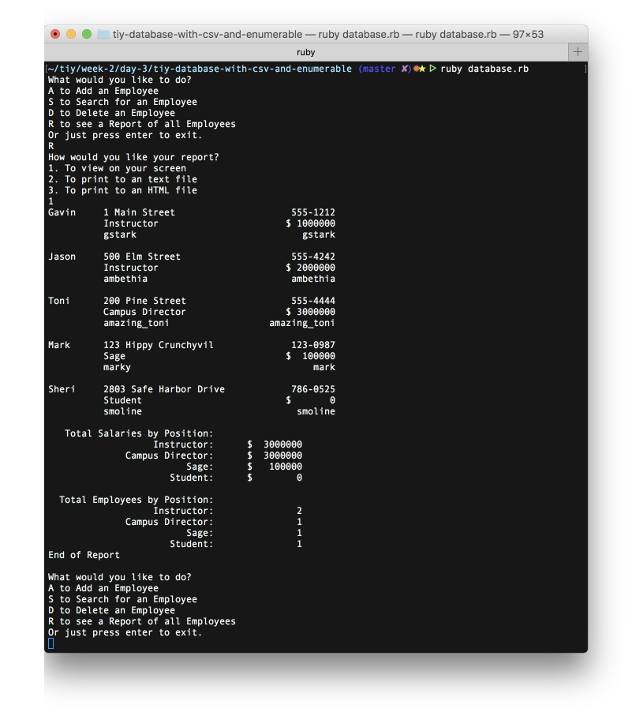

# Employee Database with CSV and Enumerables

* This program is a continuation of the first:
  * All searching and deleting methods use a more appropriate enumerable instead of loop
  * The application reads the existing employees from a csv file named employees.csv
* This version does not allow creating a new person if their name already exists
* When searching for a person, it will allow for matching any of the following:
  * partial match against the person's name
  * an exact match of the Slack Account
  * an exact match of the Github Account
* If the person is found, it shows all their relevant information in a nicely formatted presentation.
* If a person is not found, it informs the user
* When deleting a person, it prompts for the name and searches for an exact match.
* If found, it deletes the person, otherwise it tells the user there wasn't a match.
* Every time an employee is added or deleted the program rewrites the employees.csv file
* A menu option for a Report has been added, the report contains:
  * each employee and their details (name, phone, address, position, salary, slack account, github account)
  * the total salary for each of the following:
    * Instructor
    * Campus Director
  * total count for each of the following:
    * Instructor
    * Campus Director
    * Student
* The Report is formatted in a nice tabular output where each column is the same width.
* The report can handle any type of position, not just the ones listed previously

